# Knowledge map

The signal-first CRM, visualised. Every node below is clickable — it links to the deep-dive document for that concept.

If you prefer prose over diagrams, the "Lifecycle of a signal" section below the map walks through the same nodes as a narrative.

> **Standalone HTML version available at [MAP.html](./MAP.html)** — open it locally in any browser (no GitHub or Mermaid plugin needed). Same diagram, same clickable nodes, same lifecycle prose, with the styling matched to the knowledge base.

---

## The system at a glance

```mermaid
flowchart TB
    subgraph Sources["📡 Sources — signals arrive"]
        direction TB
        Teamfluence["Teamfluence<br/>LinkedIn engagement"]
        Dripify["Dripify<br/>LinkedIn outbound"]
        Unipile_in["Unipile<br/>DM replies"]
        Calendly["Calendly<br/>meetings booked"]
        Resend_in["Resend<br/>email lifecycle"]
        HubSpot_in["HubSpot<br/>contact updates"]
        Stripe["Stripe<br/>revenue events"]
        Attribution["Attribution app<br/>click tracking"]
        MVPR_cov["MVPR<br/>coverage + journalist threads<br/>(API-fed; any PR source works)"]
        Manual["Wizard / CSV<br/>contact import"]
    end

    subgraph Processing["⚙️ Processing — derive meaning"]
        direction TB
        ScoreDeriv["Score derivation"]
        PersonaMatch["Persona match"]
        FingerprintResolve["Fingerprint resolution<br/>(3 scopes)"]
        StageTrans["Stage transitions<br/>(meeting booked → MQL)"]
        DNC["DNC / exclusion"]
        DedupWaterfall["Dedup waterfall<br/>(LinkedIn → domain → name)"]
    end

    subgraph Storage["💾 Storage layers"]
        direction TB
        Upstash["Upstash Redis<br/>workspace config + secrets"]
        Postgres["Postgres<br/>the projection"]
        HubSpot_mir["HubSpot<br/>CRM mirror"]
    end

    subgraph Surfaces["🖥️ Surfaces — humans use these"]
        direction TB
        SDR["SDR action list"]
        Companies["Companies view"]
        Delivery["Delivery<br/>(channels + campaigns)"]
        Reports["Reports<br/>(PR / costs / funnel)"]
        Settings["Settings<br/>(per workspace)"]
    end

    subgraph Outbound["📤 Outbound — humans send things"]
        direction TB
        Drafter["Drafter<br/>(LLM + persona + fingerprint)"]
        LinkedInDM["LinkedIn DM<br/>(Unipile out)"]
        Email["Email<br/>(Resend out)"]
        Newsletter["Newsletter"]
        Calls["Outbound Calls<br/>(log-only, no fingerprint)"]
    end

    subgraph CoreEntities["🧱 Core entities"]
        direction LR
        Signal["Signal"]
        Contact["Contact"]
        Company["Company"]
        Influencer["Influencer<br/>(person or org)"]
        OutreachLog["Outreach log"]
        Persona["Persona"]
        Fingerprint["Style fingerprint"]
    end

    Sources -->|writes| Processing
    Processing -->|appends rows to| Storage
    Storage -->|reads from| Surfaces
    Surfaces -->|triggers| Outbound
    Outbound -.->|emits sent_dm / sent_email signals| Processing

    Storage -.- CoreEntities

    click Teamfluence href "./docs/WEBHOOKS.md" "Teamfluence webhook contract"
    click Dripify href "./docs/WEBHOOKS.md" "Dripify webhook contract"
    click Unipile_in href "./docs/WEBHOOKS.md" "Unipile inbound + outbound"
    click Calendly href "./docs/WEBHOOKS.md" "Calendly webhook contract"
    click Resend_in href "./docs/WEBHOOKS.md" "Resend lifecycle webhook (lands in apps/attribution/)"
    click HubSpot_in href "./docs/WEBHOOKS.md" "HubSpot inbound webhook"
    click Stripe href "./docs/WEBHOOKS.md" "Stripe webhook contract"
    click Attribution href "./docs/CAMPAIGNS.md" "Click attribution flow"
    click MVPR_cov href "./docs/PR-LinkedIn-Measurement.md" "PR + LinkedIn + Teamfluence closed loop"
    click Manual href "./docs/CONTACTS.md" "The 5 paths people enter the system"

    click ScoreDeriv href "./PHILOSOPHY.md" "Per-workspace thresholds, not global scoring"
    click PersonaMatch href "./GLOSSARY.md" "Persona — first match wins; strict matching"
    click FingerprintResolve href "./docs/adr/004-three-fingerprint-scopes.md" "ADR-004 — three fingerprint scopes"
    click StageTrans href "./docs/adr/012-meeting-booked-stage-transition.md" "ADR-012 — meeting-booked → Discovery Call"
    click DNC href "./GLOSSARY.md" "DNC: temporal suppression. Exclude: permanent."
    click DedupWaterfall href "./docs/adr/002-companies-first-class-entity.md" "ADR-002 — companies as first-class entity"

    click Upstash href "./ARCHITECTURE.md" "Upstash Redis workspace config"
    click Postgres href "./ARCHITECTURE.md" "Postgres projection — the warehouse view"
    click HubSpot_mir href "./docs/adr/010-crm-as-secondary-projection.md" "ADR-010 — CRM is secondary, Postgres is primary"

    click SDR href "./CLAUDE.md" "SDR action list — the seller's daily view"
    click Companies href "./docs/adr/002-companies-first-class-entity.md" "Companies grouping + transitional state"
    click Delivery href "./docs/CAMPAIGNS.md" "Campaigns + delivery flow"
    click Reports href "./docs/CAMPAIGNS.md" "Reports surface — click attribution + funnel"
    click Settings href "./CLAUDE.md" "Per-workspace settings UI"

    click Drafter href "./docs/DRAFTER.md" "The drafter — LLM + persona + fingerprint"
    click LinkedInDM href "./docs/WEBHOOKS.md" "Unipile outbound — send-dm route + invite queue"
    click Email href "./docs/WEBHOOKS.md" "Resend outbound — send-outbound.ts"
    click Newsletter href "./docs/CAMPAIGNS.md" "Newsletter via the broadcast pipeline"
    click Calls href "./docs/adr/005-outbound-calls-not-fingerprint.md" "ADR-005 — calls are NOT a fingerprint channel"

    click Signal href "./GLOSSARY.md" "Signal — the unit of truth"
    click Contact href "./GLOSSARY.md" "Contact — one per person per workspace"
    click Company href "./GLOSSARY.md" "Company — first-class with dedup waterfall"
    click Influencer href "./docs/adr/015-influencers-first-class-entity.md" "Influencer — person or org, M2M with prospects (influences / influenced_by)"
    click OutreachLog href "./GLOSSARY.md" "Outreach log — append-only send history"
    click Persona href "./GLOSSARY.md" "Persona — buyer archetype"
    click Fingerprint href "./GLOSSARY.md" "Style fingerprint — voice profile, 3 scopes"

    classDef sourceNode  fill:#1e293b,stroke:#3b82f6,color:#dbeafe
    classDef procNode    fill:#1e293b,stroke:#10b981,color:#d1fae5
    classDef storeNode   fill:#1e293b,stroke:#f59e0b,color:#fef3c7
    classDef surfNode    fill:#1e293b,stroke:#a78bfa,color:#ede9fe
    classDef outNode     fill:#1e293b,stroke:#f472b6,color:#fce7f3
    classDef coreNode    fill:#0f172a,stroke:#64748b,color:#e2e8f0,stroke-width:2px,stroke-dasharray:4

    class Teamfluence,Dripify,Unipile_in,Calendly,Resend_in,HubSpot_in,Stripe,Attribution,MVPR_cov,Manual sourceNode
    class ScoreDeriv,PersonaMatch,FingerprintResolve,StageTrans,DNC,DedupWaterfall procNode
    class Upstash,Postgres,HubSpot_mir storeNode
    class SDR,Companies,Delivery,Reports,Settings surfNode
    class Drafter,LinkedInDM,Email,Newsletter,Calls outNode
    class Signal,Contact,Company,Influencer,OutreachLog,Persona,Fingerprint coreNode
```

Click any node to jump to its deep-dive. The dashed connection from the **Core entities** cluster to the storage layer reflects that these aren't separate components — they're the *shape of the data* every other component reads or writes.

---

## How to read this

Five functional clusters + one cluster of core entities.

| Cluster | What it does | Where it lives in code |
|---|---|---|
| **📡 Sources** | Webhooks + import paths. Every signal-emitting external system the workspace integrates with. | `apps/web/app/api/webhooks/[workspaceId]/*`, `apps/attribution/api/*`, `apps/web/app/wizard/*` |
| **⚙️ Processing** | Pure-function logic that derives meaning from raw signals. Score derivation, persona match, fingerprint resolution, stage transitions, DNC, dedup waterfall. | `apps/web/lib/{persona-match,style/fetch-fingerprints,db/*}` |
| **💾 Storage** | Three layers with different durability + cardinality. Tenant config (Upstash), the projection (Postgres), the CRM mirror (HubSpot). | `apps/web/lib/db/schema.sql`, `apps/web/lib/workspace-config.ts`, `packages/crm-adapters/` |
| **🖥️ Surfaces** | Where humans see data. The dashboard's main pages. | `apps/web/app/dashboard/[workspaceId]/*` |
| **📤 Outbound** | The send paths. Where the drafter turns "this contact is high-score and matches persona X" into "this email got sent at 14:32." | `apps/web/lib/{email,unipile}`, `apps/web/app/api/dashboard/[workspaceId]/{send-dm,send-email,draft-*}` |
| **🧱 Core entities** | The shape of the data, not separate components. Every cluster above reads or writes these. | `schema.sql` for the storage shape; `GLOSSARY.md` for the definitions |

The **dotted feedback arrow** from Outbound → Processing is the system's most important property: every outbound action becomes an inbound signal. Sending a DM appends a `sent_dm` signal. Sending an email appends `sent_email`. The system's own behaviour is observable through the same lens as the prospect's behaviour. That's what makes the audit trail honest.

---

## Lifecycle of a signal

The same diagram, told as a story. Follow a single signal from arrival to outbound + back. The numbered references point to clusters and nodes in the diagram above.

### 1. A signal arrives (📡 **Sources**)

A prospect likes a post on LinkedIn. Teamfluence detects it, fires a webhook at `/api/webhooks/[workspaceId]/teamfluence`. The handler:
- Verifies the signature is acceptable (Teamfluence is the exception — auth is workspace UUID in the URL path; see ADR-011).
- Extracts the actor, the verb (`liked_post`), the object (the post URL), the timestamp.
- Looks up the contact by LinkedIn URL; creates one if not found.
- Resolves the company through the **Dedup waterfall** (LinkedIn URL → domain → canonical name; see ADR-002).

### 2. Processing the event (⚙️ **Processing**)

The handler doesn't just write the row — it processes through several pure-function layers:

- **Score derivation** applies the per-workspace weight for `liked_post` (e.g. +3 points). Total `signal_score` updates.
- The contact's **funnel stage** is recomputed against `WorkspaceConfig.scoring.thresholds`. A contact at score 24 might move from "Engaged" to "Highly Engaged."
- **DNC / exclusion** is checked — if the contact has DNC set, outbound paths will skip them but the signal still records (you want the engagement history even for people you can't currently reach).

### 3. Persistence (💾 **Storage**)

Three things happen at three layers:

- **Postgres**: a new `signals` row is appended (append-only, see ADR-009). The contact's `signal_score` + `signal_count` + `last_signal_at` are updated in the same transaction.
- **Upstash Redis**: nothing changes — workspace config doesn't move on every signal.
- **HubSpot (mirror)**: for Teamfluence signals, the handler also calls `createCrmAdapter(config).createSignal(...)` to write a HubSpot timeline event. Best-effort — if HubSpot is down, the Postgres write succeeded, and the mirror catches up later (see ADR-010, ADR-011).

Dripify signals would have stopped at Postgres — they deliberately don't push to HubSpot (see ADR-003).

### 4. Surfacing (🖥️ **Surfaces**)

The signal is now visible:

- On the **SDR action list**, the contact's row reorders by `last_signal_at DESC`. They float to the top.
- On the **Companies view**, the contact's company score gets a bump too (aggregate across all its contacts).
- The contact's funnel stage label (`Highly Engaged`, rendered as "Highly Engaged" in SDR view) updates.

### 5. Outbound (📤 **Outbound** — when the seller acts)

The seller clicks "Draft DM" on the contact. The **Drafter** runs:

- Pulls the contact + recent signals.
- Calls `pickPersona(contact)` to find the best persona match. Result is "Engineering Manager" (or none — see PHILOSOPHY.md on unmatched contacts).
- Calls `fetchFingerprints({ workspace, channel: 'linkedin_dm', persona })` — resolves through three scopes (corporate → channel → channel_persona, see ADR-004) and picks the most-specific row.
- Renders the prompt with persona context + fingerprint constraints + recent signal context, hits Anthropic, returns the draft.

The seller reviews. The seller sends. The send path (`/api/dashboard/[workspaceId]/send-dm`) routes through `sendLinkedInDm` (Unipile).

### 6. Feedback loop (📤 → 📡)

The send appends:
- A new `signals` row with verb `sent_dm` (so we know we contacted them, even if not "engagement" in the buyer sense).
- A new `outreach_log` row recording `(workspace_id, contact_id, channel, fingerprint_version_id, sent_at, status)`. The `fingerprint_version_id` is the *exact* fingerprint row that drove this draft — critical for outcome attribution later.

The cycle starts again: when the prospect replies, Unipile fires an inbound webhook with `replied_dm_initial`. That signal's score weight is higher; the contact moves further up the SDR list. The reply is AI-classified; if "interested" the contact stays on the list; if "not interested" they flip to DNC.

If the prospect books a meeting through Calendly, the **Stage transition** rule fires (ADR-012). The contact's `manual_stage` flips to `Discovery Call` (rendered as "Ambassador" in SDR view); the company's stage moves too unless it's past Discovery Call already (don't-regress guard).

The funnel keeps moving. The audit trail keeps the score recomputable. The fingerprint that drove this conversation is traceable through `outreach_log` to outcome.

---

## Reading order for someone new to the codebase

The clusters in the diagram correspond loosely to where you read about them:

1. **The why** — `PHILOSOPHY.md` (read first; design tenets that explain why the system is shaped this way)
2. **The what** — `GLOSSARY.md` (canonical terms; the language the diagram uses)
3. **The how at system level** — `ARCHITECTURE.md` (the same lifecycle in more depth)
4. **The operating manual** — `CLAUDE.md` (auto-loads in Claude Code sessions)
5. **Why specific things are the way they are** — `docs/adr/` (one ADR per non-obvious decision)
6. **The cookbook** — `docs/WEBHOOKS.md`, `docs/CAMPAIGNS.md`, `docs/CONTACTS.md`, `docs/DRAFTER.md`

A new contributor working in a specific area can click directly to the deep-dive node from the diagram and skip the rest.

---

## When the diagram is wrong

The diagram is an abstraction. When the code diverges from it (which it will, as the system evolves), update this file and the linked deep-dives in lockstep. The diagram is *not* generated from code — it's a curated view, and keeping it accurate is a maintenance task.

The most common drift causes:
- A new webhook source landing without being added to the **📡 Sources** cluster.
- A new processing step (e.g. an AI classifier) that earns its own node.
- A new surface (a new dashboard page) that doesn't yet appear.

If you spot drift while reading: file an issue or open a PR.
